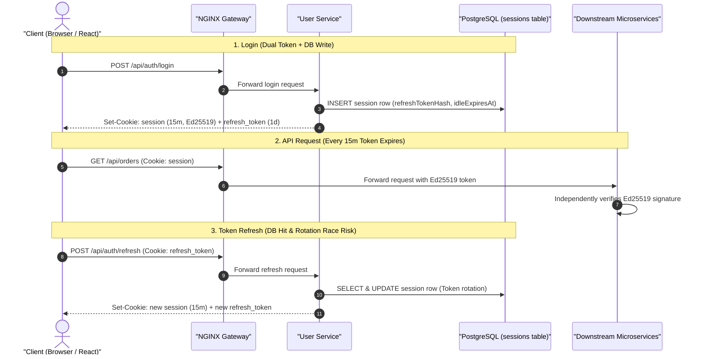
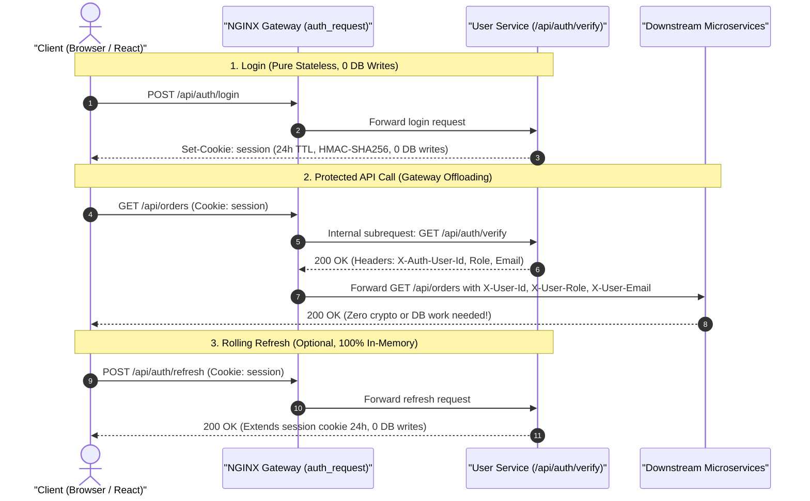

<!--
AI Assistance Disclosure:
Tool: Google Antigravity Agent, date: 2026-09-28
Scope: Comprehensive pull request documentation covering migration motivation, before/after architectural mermaid diagrams, team developer guide, single stateless session cookie transition, and verification steps.
Author review: (to be completed by author after review)
-->
## Summary

Transitions authentication across the platform from legacy asymmetric Ed25519 keys and stateful database sessions to a **true single stateless session cookie (`session`) with NGINX API Gateway authentication offloading (`auth_request`)**.

### What This PR Solves at a Glance:
- **No More Access / Refresh Token Split**: Replaced the dual-token model (`session` 15-minute cookie + `refresh_token` 1-day cookie) with a **single stateless session cookie** (`session`) lasting **24 hours (`1d`)** by default (or **30 days** for persistent logins).
- **PostgreSQL `sessions` Table Retired**: The database `sessions` table is no longer written to or queried during login, refresh, or API verification. All session validation is purely in-memory and cryptographic.
- **NGINX Gateway Authentication Offloading**: The NGINX API Gateway intercepts incoming requests to protected routes (`/api/users/*`, `/api/orders/*`, `/api/credits/*`) and verifies the session token with `user-service` via an internal subrequest (`auth_request /internal/auth/verify`). Upon verification, NGINX forwards pre-authenticated identity headers downstream (`X-User-Id`, `X-User-Role`, `X-User-Email`).
- **Complete Asymmetric Key Purge**: Fully removed `scripts/generate-jwt-keys.mjs`, `JWT_PRIVATE_KEY`, and `JWT_PUBLIC_KEY`. Microservices and tests now rely on a standard symmetric secret (`SESSION_SECRET`).

---

## Motivation & Problem Statement

Prior to this PR, our authentication architecture suffered from four major pain points:

1. **Dual Access/Refresh Token Complexity & Expiry Friction**:
   - The short 15-minute access token TTL forced frontend applications to implement complex silent-refresh loops and 401 retry interceptors.
   - When users switched tabs, refreshed pages, or experienced momentary network jitter, token rotation races could invalidate valid sessions and abruptly log students out.
2. **Unnecessary Database Bottlenecks on `sessions` Table**:
   - Every single login inserted a row into PostgreSQL `sessions`, every token refresh queried and updated a row, and background queries had to opportunistically delete expired rows.
   - For an application designed to scale across thousands of campus students ordering food and errands concurrently, writing session state to disk on every auth event created an avoidable database I/O bottleneck.
3. **Key Management & Local Dev Friction**:
   - Asymmetric Ed25519 signing required executing `scripts/generate-jwt-keys.mjs` before spinning up Docker containers.
   - If keys were missing or mismatched between containers, services crashed at boot with fatal configuration errors.
4. **Redundant Cryptographic Verification Fleet-wide**:
   - Every internal microservice (User, Supplier, Order, Credit, Notification) had to independently extract Bearer tokens and perform cryptographic signature validation, despite already being behind our trusted reverse proxy gateway.

---

## Architecture Overview: Before vs. After

### Before: Asymmetric Dual Tokens with Database-Backed Session Table


### After: True Single Stateless Session Cookie & NGINX Gateway Offloading


---

## Team Developer Guide: What You Need to Know

### Comparison Cheat Sheet

| Feature / Dimension | Legacy Architecture | New Architecture (This PR) |
| :--- | :--- | :--- |
| **Cookies** | Dual cookies: `session` (15m) + `refresh_token` (1d/30d) | **Single cookie**: `session` (24h default, 30d persistent) |
| **Session Lifetime** | Expired every 15 minutes; required continuous refreshes | **24 hours (`1d`)** active window; extends seamlessly |
| **Database `sessions` Table** | Row inserted on login, queried & updated on every refresh | **Untouched** (100% stateless in-memory verification) |
| **Token Cryptography** | Asymmetric Ed25519 (`JWT_PRIVATE_KEY` / `JWT_PUBLIC_KEY`) | **Symmetric HMAC-SHA256** (`SESSION_SECRET`) |
| **API Authentication** | Every downstream service parsed & verified tokens | **NGINX Gateway offloads auth** (`auth_request`) |
| **Downstream Headers** | Raw Bearer JWT token in `Authorization` header | Pre-verified **`X-User-Id`**, **`X-User-Role`**, **`X-User-Email`** |
| **Local Dev Setup** | Must run `npm run generate:jwt-keys` before container boot | **Zero setup**: run `docker compose up` immediately |

---

### Guidelines for Frontend Developers (React / Vite)

1. **No More Dual-Token Choreography**:
   - You do **not** need to track separate access tokens and refresh tokens.
   - The browser automatically sends the `session` cookie on all API calls (`credentials: 'include'` or standard same-origin requests through the gateway / Vite proxy).
2. **Session Persistence on Refresh**:
   - On page load or app launch, `App.tsx` calls `POST /api/auth/refresh`.
   - The server inspects the valid `session` cookie, rolls its expiration forward by 24 hours, and returns `{ success: true, data: { accessToken } }`.
3. **Logging Out**:
   - Simply call `POST /api/auth/logout`. The response clears the `session` cookie (`Max-Age=0`).
   - Any subsequent protected API request is immediately rejected by NGINX with `401 Unauthorized`.

---

### Guidelines for Backend Microservice Developers (Express / Node)

1. **When Behind NGINX Gateway**:
   - NGINX intercepts the request, verifies the user, and injects trusted identity headers:
     ```ts
     const userId = req.header('x-user-id');
     const role = req.header('x-user-role');
     const email = req.header('x-user-email');
     ```
2. **Using `@campus-errand/auth` (`authMiddleware`)**:
   - The shared middleware automatically checks for gateway headers first.
   - If present, it populates `res.locals.auth.userId` and `res.locals.auth.role` **without performing redundant cryptographic signature verification**.
3. **Standalone Testing & Fallback**:
   - For standalone unit tests or integration tests running without NGINX, `authMiddleware` automatically falls back to verifying `Authorization: Bearer <token>` or `Cookie: session` directly using `SESSION_SECRET`.

---

## Linked issues

Closes #49

---

## Changes

- **Acceptance Criteria Covered:**
  - `[N2.2]`: The application shall enforce authentication and authorization for protected operations.
  - `[N2.2.1]`: Protected endpoints and actions shall only be accessible to authenticated users.
  - `[N2.2.2]`: The system shall restrict modification operations so that users may only be allowed to modify resources they own or are authorized to manage.

- **True Single Stateless Session Cookie (`services/user-service`):**
  - Eliminated the `refresh_token` cookie and stopped all writes/queries to the PostgreSQL `sessions` table during authentication.
  - Configured a single symmetric `session` cookie (`Path=/; HttpOnly; SameSite=Lax; Max-Age=86400`) issued on login.
  - Set default session TTL to 24 hours (`1d` or configurable via `SESSION_TTL`), supporting `30d` for persistent logins (`keepLoggedIn: true`).
  - Updated `POST /api/auth/refresh` to validate and extend the single `session` cookie in-memory while preserving backward compatibility for React mount-time session restoration.
  - Updated `POST /api/auth/logout` to clear the `session` cookie without requiring database deletions.
  - Added `findById(id)` to `AuthRepository` for fast stateless user status checks.

- **NGINX Gateway Offloading (`gateway/nginx.conf`):**
  - Added internal verification location `/internal/auth/verify` proxying to `http://user_service_upstream/api/auth/verify`.
  - Configured `auth_request /internal/auth/verify` on protected API routes (`/api/users/`, `/api/orders/`, `/api/credits/`).
  - Mapped upstream auth response headers to downstream headers: `auth_request_set $auth_user_id $upstream_http_x_auth_user_id`, `proxy_set_header X-User-Id $auth_user_id`, `X-User-Role`, and `X-User-Email`.

- **User Service Verification Endpoint (`services/user-service`):**
  - Added `GET /api/auth/verify` endpoint returning `200 OK` with `X-Auth-User-Id`, `X-Auth-User-Role`, `X-Auth-User-Email` response headers when the `session` cookie or Bearer token is valid, or `401 Unauthorized` if missing/invalid.
  - Implemented pure symmetric HMAC-SHA256 (`HS256`) session token signing and verification in `src/auth/tokens.ts` using `SESSION_SECRET`.
  - Restored `GET /api/users/:id` 501 Not Implemented placeholder in `src/users/user-routes.ts`.

- **Shared Auth Package (`packages/auth`):**
  - Updated `authMiddleware` to inspect incoming gateway headers (`X-User-Id`, `X-User-Role`, `X-User-Email`) and populate `res.locals.auth` without redundant cryptographic re-verification.
  - Retained fallback direct symmetric token validation against `SESSION_SECRET` (from `Authorization: Bearer` or `Cookie: session`) for local test suites.

- **Full Ed25519 Key Purge:**
  - Deleted `scripts/generate-jwt-keys.mjs` and removed `"generate:jwt-keys"` from `package.json`.
  - Purged asymmetric key reading and signing logic from `packages/auth/src/index.ts`, `services/user-service/src/config.ts`, `services/user-service/src/auth/tokens.ts`, and `services/supplier-service/src/backend/server.ts`.
  - Removed `JWT_PRIVATE_KEY` and `JWT_PUBLIC_KEY` from `docker-compose.yml`, root `.env.example`, and `services/user-service/.env.example`.

- **Documentation & AI Usage Log:**
  - Updated `CLAUDE.md`, `.claude/agents/infrastructure.md`, and service documentation markdown files.
  - Logged architecture migration and full purge entries in `ai/usage-log.md`.

---

## How to test

### 1. Automated Test Suite & Typecheck
```bash
npm run typecheck
npm run test:d2
```
- **Typecheck Result**: Passed across all 9 workspaces with 0 errors.
- **D2 Test Suite Result**: **50/50 tests passed** (0 failed across all 6 milestone scenarios, including gateway offloaded verification and role-based access control).

### 2. Live Docker Verification (Zero DB Session Writes)
Start the stack and test the single session cookie lifecycle:
```bash
docker compose up --build -d
```
1. **Login & Cookie Inspection**:
   ```bash
   curl -i -s -X POST http://localhost/api/auth/login \
     -H "Content-Type: application/json" \
     -d '{"email":"alice@u.nus.edu","password":"Password123!"}'
   ```
   *Expected*: Returns HTTP 200 with a single `Set-Cookie: session=...; Max-Age=86400; Path=/; HttpOnly; SameSite=Lax`. Any legacy `refresh_token` cookie is cleared.
2. **Verify Zero Database Writes**:
   ```bash
   docker compose exec postgres psql -U postgres -d user_db -c "SELECT count(*) FROM sessions;"
   ```
   *Expected*: Count does not increase on login or refresh (0 database writes).
3. **Protected API Access via Gateway**:
   ```bash
   curl -i -s http://localhost/api/users/me -H "Cookie: session=<TOKEN>"
   ```
   *Expected*: Returns HTTP 200 with user profile. NGINX subrequest verified token and injected `X-User-Id`.
4. **Session Refresh**:
   ```bash
   curl -i -s -X POST http://localhost/api/auth/refresh -H "Cookie: session=<TOKEN>"
   ```
   *Expected*: Returns HTTP 200 and rolls the single `session` cookie forward by 24h.
5. **Logout & Invalidation**:
   ```bash
   curl -i -s -X POST http://localhost/api/auth/logout -H "Cookie: session=<TOKEN>"
   curl -i -s http://localhost/api/users/me
   ```
   *Expected*: Logout returns 204 No Content and clears the cookie. Subsequent call immediately returns HTTP 401 Unauthorized from NGINX.

### 3. Automated Frontend Browser Verification
- **Student App (`http://localhost/` or `:5173`)**:
  - Invalid login (`alice@u.nus.edu` / `WrongPassword!`) displays inline 401 error message.
  - Valid student login (`alice@u.nus.edu` / `Password123!`) stores single `session` cookie, loads student dashboard, credit balance (100 C), errand feed, and campus supplier directory (21 locations).
  - Logout cleanly clears the session cookie and returns to login screen.
- **Admin Portal (`http://localhost/admin/` or `:5174`)**:
  - Admin login (`admin@nus.edu.sg` / `Password123!`) displays admin metrics, supplier management controls, and allows toggling supplier availability (`Active` <-> `Unavailable`).

---

## Checklist

- [x] Linked issue(s) above use `Closes #`, `Fixes #`, or `Resolves #`
- [x] Tests / manual verification done
- [x] Docs updated if needed
