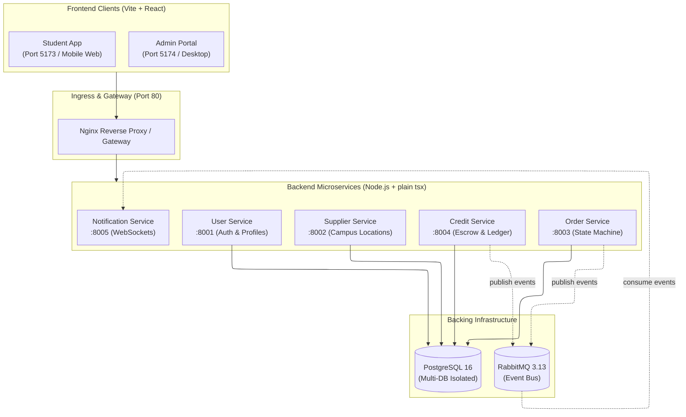

# NUS CampusErrand 🏃‍♂️💨

> **CS3219 Software Design and Architecture (AY26/27 S1)**  
> Peer-to-Peer Campus Errand Platform with Closed Credit Economy

NUS CampusErrand connects students who need quick favors (coffee from COM3, printing at PCCommons, parcel pickup from PGPR) with peers already walking nearby. The platform operates on a **closed credit economy** with escrow guarantees, discrete milestone updates, and asynchronous event notifications.

---

## 🏛️ Architecture & System Design

The project uses a **Database-per-Service Microservices Architecture** organized in an **npm monorepo**:



---

## 🚀 Quick Start with Docker (Recommended)

To spin up all 5 microservices, 2 frontend apps, PostgreSQL, RabbitMQ, and the Nginx Gateway:

```bash
# In project root:
docker compose up --build
```

### Accessing the Platform
| Component | Local Access URL | Description |
| :--- | :--- | :--- |
| **Unified Web Ingress** | [http://localhost](http://localhost) | Main Gateway (routes to Student Mobile App) |
| **Admin Portal** | [http://localhost:5174](http://localhost:5174) | Campus Supplier Directory Management |
| **Student App (Direct)** | [http://localhost:5173](http://localhost:5173) | Vite Dev Server |
| **User Service Health** | [http://localhost/api/users/me](http://localhost/api/users/me) | Routed via Nginx Gateway |
| **Order Service Health** | [http://localhost/api/orders](http://localhost/api/orders) | Open Errand Discovery Feed |
| **RabbitMQ Web Dashboard** | [http://localhost:15672](http://localhost:15672) | Login: `guest` / `guest` |
| **PostgreSQL Shell** | `docker exec -it campuserrand-postgres psql -U postgres` | Database shell |

---

## 💻 Local Development Workflow (Without Docker)

When coding individual features, you can develop directly on your machine with instant hot-reloading:

### 1. Install all dependencies across the monorepo
```bash
npm install
```

### 2. Start PostgreSQL & RabbitMQ
```bash
docker compose up postgres rabbitmq -d
```

### 3. Run individual services with `tsx` hot-reloading
```bash
# Run backend microservices
npm run dev:user        # Port 8001
npm run dev:supplier    # Port 8002
npm run dev:order       # Port 8003
npm run dev:credit      # Port 8004
npm run dev:notif       # Port 8005

# Run frontend applications
npm run dev:student     # Port 5173 (Vite HMR)
npm run dev:admin       # Port 5174 (Vite HMR)
```

---

## 📦 Monorepo Directory Structure

```
├── apps/
│   ├── student-app/             # Student Mobile Web (Vite + React + TS + Tailwind)
│   └── admin-portal/            # Staff Admin Web Portal (Vite + React + TS)
├── services/
│   ├── user-service/            # Port 8001: Auth, Profiles, RBAC (M2)
│   ├── supplier-service/        # Port 8002: Campus Locations CRUD (M3)
│   ├── order-service/           # Port 8003: Lifecycle State Machine (M4)
│   ├── credit-service/          # Port 8004: Closed Economy Ledger & Escrow (M5)
│   └── notification-service/    # Port 8005: WebSockets & Async Push (M6)
├── packages/
│   └── common-dtos/             # Shared TypeScript schemas, DTOs & event types
├── docs/
│   └── TEAM_ONBOARDING_GUIDE.md # Detailed pedagogical engineering guide for teammates
├── gateway/
│   └── nginx.conf               # API Gateway reverse proxy configuration
└── docker/
    └── postgres-init/           # PostgreSQL multi-database schema initialization
```

---

## 📖 Team Learning & Documentation
For a deep dive into the architecture, npm workspaces, `tsx` runtime, RabbitMQ event choreography, database isolation, and Docker, read **[`docs/TEAM_ONBOARDING_GUIDE.md`](./docs/TEAM_ONBOARDING_GUIDE.md)**.
