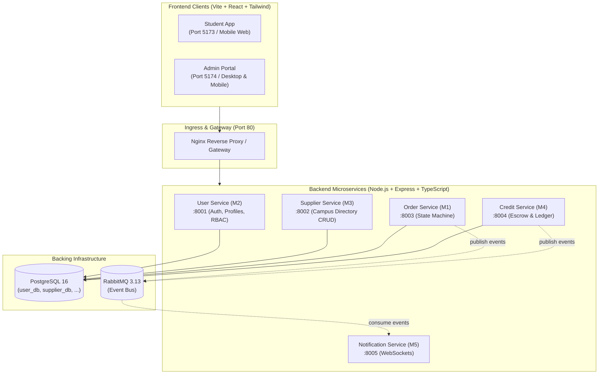

# Friend of Campus (FoC) 🏃‍♂️💨

> **CS3219 Software Design and Architecture (AY26/27 S1) — Project Group 25**  
> Peer-to-Peer Campus Errand Platform with Closed Credit Economy & Verified Campus Suppliers

Friend of Campus connects NUS students who need quick favors (coffee from COM3, printing at Central Library, parcel pickup from PGPR) with peers already walking nearby. The platform operates on a **closed credit economy** with escrow guarantees, discrete milestone updates, role-based access control, and asynchronous event notifications.

---

## 🏛️ Architecture & System Design

The platform uses a **Database-per-Service Microservices Architecture** organized in an **npm workspaces monorepo**:



### Key Design Highlight: Multi-Service Prisma Isolation
To avoid client collisions in the root `node_modules/@prisma/client`, each microservice generates its client to an isolated internal path (`output = "../generated/client"`). This guarantees compile-time type safety and prevents engine dylib conflicts across services.

---

## 🎯 Milestone Status

| Milestone | Scope & Deliverables | Status |
| :--- | :--- | :---: |
| **D1** | System Design, Product Backlog, Wireframes & Contracts | ✅ Completed |
| **D2** | **User Service (M2) & Supplier Service (M3) Integration**<br/>• PostgreSQL persistence via Prisma ORM<br/>• Salted bcrypt password hashing & domain validation<br/>• Stateless JWT authentication & Express RBAC middleware<br/>• Cross-service authorization (Admin CRUD vs Student 403 Forbidden)<br/>• Admin Portal (CRUD modals, sorting, search, Screen 6 mobile cards)<br/>• Student App live directory integration & spot pre-selection<br/>• 30/30 automated end-to-end integration tests passing | ✅ **Completed** |
| **D3** | **Order Service (M1) & Credit Service (M4)** (Escrow, State Machine) | ⏳ Upcoming |
| **D4** | **Notification Service (M5)** (RabbitMQ event choreography & WebSockets) | ⏳ Upcoming |

---

## 🚀 Quick Start with Docker (Recommended)

To spin up all microservices, frontends, PostgreSQL, RabbitMQ, and the Nginx Gateway:

```bash
# In project root:
docker compose up --build
```

### Accessing the Platform
| Component | Local Access URL | Description |
| :--- | :--- | :--- |
| **Unified Web Ingress** | [http://localhost](http://localhost) | Main Gateway (routes to Student Mobile App) |
| **Admin Portal** | [http://localhost:5174](http://localhost:5174) | Campus Supplier Directory Management |
| **Student App** | [http://localhost:5173](http://localhost:5173) | Student Errand Feed & Campus Spots |
| **User Service Health** | [http://localhost:8001/health](http://localhost:8001/health) | M2 Health Probe (`/api/users/me` for auth) |
| **Supplier Service Health**| [http://localhost:8002/health](http://localhost:8002/health) | M3 Health Probe (`/api/suppliers` for catalog) |
| **RabbitMQ Web Dashboard** | [http://localhost:15672](http://localhost:15672) | Login: `guest` / `guest` |
| **PostgreSQL Shell** | `docker exec -it campuserrand-postgres psql -U postgres` | Database shell |

---

## 💻 Local Development Workflow (Without Docker)

When developing individual features directly on your machine with instant TypeScript execution (`tsx`) and hot-reloading:

### 1. Install dependencies & generate Prisma clients
```bash
npm install
```
*(Runs root `postinstall` hook which automatically executes `prisma generate` across all services).*

### 2. Start PostgreSQL & RabbitMQ
```bash
docker compose up postgres rabbitmq -d
```

### 3. Seed Databases (First Time Setup)
```bash
# Seed User Service (admin@nus.edu.sg, alice@u.nus.edu, bob@u.nus.edu)
npm run db:seed --workspace=@campus-errand/user-service

# Seed Supplier Service (21 verified NUS campus locations from CSV)
npm run db:seed --workspace=@campus-errand/supplier-service
```

### 4. Run Development Servers
```bash
# Backend microservices
npm run dev:user        # Port 8001 (User & Auth Service)
npm run dev:supplier    # Port 8002 (Supplier Directory Service)
npm run dev:order       # Port 8003 (Order Service)
npm run dev:credit      # Port 8004 (Credit Service)
npm run dev:notif       # Port 8005 (Notification Service)

# Frontend applications
npm run dev:student     # Port 5173 (Student Web App)
npm run dev:admin       # Port 5174 (Admin Web Portal)
```

---

## 🧪 Testing & Verification

### Automated Milestone D2 End-to-End Suite
Runs 30 integration test cases verifying user registration, NUS domain checks, bcrypt authentication, profile immutability protection, sole-admin demotion safeguards, supplier querying, and cross-service RBAC enforcement:

```bash
npm run test:d2
```

### Universal Typecheck
Typechecks all 8 packages and microservices in parallel:
```bash
npm run typecheck
```

---

## 🔐 Default Seed Accounts & Credentials

For local development, testing, and mentor demonstrations, the following accounts are pre-seeded:

| Role | Email Address | Password | Permissions |
| :--- | :--- | :--- | :--- |
| **Administrator** | `admin@nus.edu.sg` | `AdminPassword123!` | Full directory CRUD, user role management, dispute resolution |
| **Student (Alice)** | `alice@u.nus.edu` | `Password123!` | Dual-role (Requester/Courier), read directory, manage profile |
| **Student (Bob)** | `bob@u.nus.edu` | `Password123!` | Dual-role (Requester/Courier), read directory, manage profile |

---

## 📦 Monorepo Structure

```
friend-on-campus/
├── apps/
│   ├── student-app/             # Student Mobile PWA (Port 5173)
│   └── admin-portal/            # Staff Admin Web Portal (Port 5174)
├── services/
│   ├── user-service/            # Port 8001: Auth, Profiles, RBAC (M2)
│   ├── supplier-service/        # Port 8002: Campus Locations CRUD (M3)
│   ├── order-service/           # Port 8003: Lifecycle State Machine (M1)
│   ├── credit-service/          # Port 8004: Closed Economy Ledger & Escrow (M4)
│   └── notification-service/    # Port 8005: WebSockets & Async Push (M5)
├── packages/
│   └── common-dtos/             # Shared TypeScript schemas, DTOs & event types
├── scripts/
│   └── test-d2-e2e.ts           # Milestone D2 30-case integration test runner
├── data/
│   └── csv/                     # NUS campus supplier seed datasets
├── docker/
│   └── postgres-init/           # PostgreSQL multi-database schema initialization
└── ai/
    └── usage-log.md             # AI assistance usage disclosures per course policy
```

---

## 📄 Milestone Documentation

- **Team Onboarding Guide**: See [`docs/onboarding-guide-sep-3.md`](./docs/onboarding-guide-sep-3.md)

