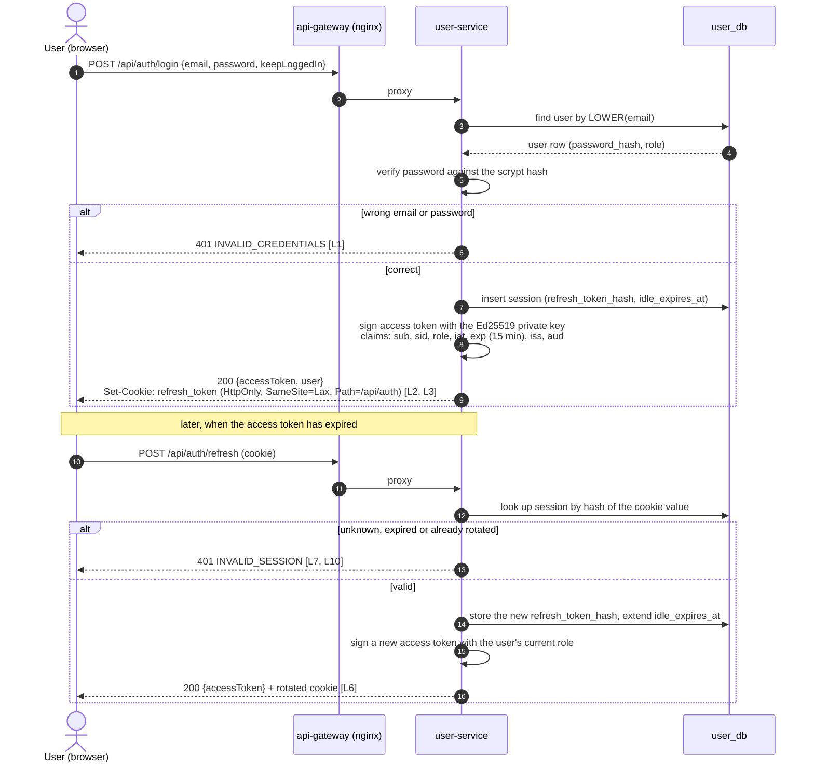
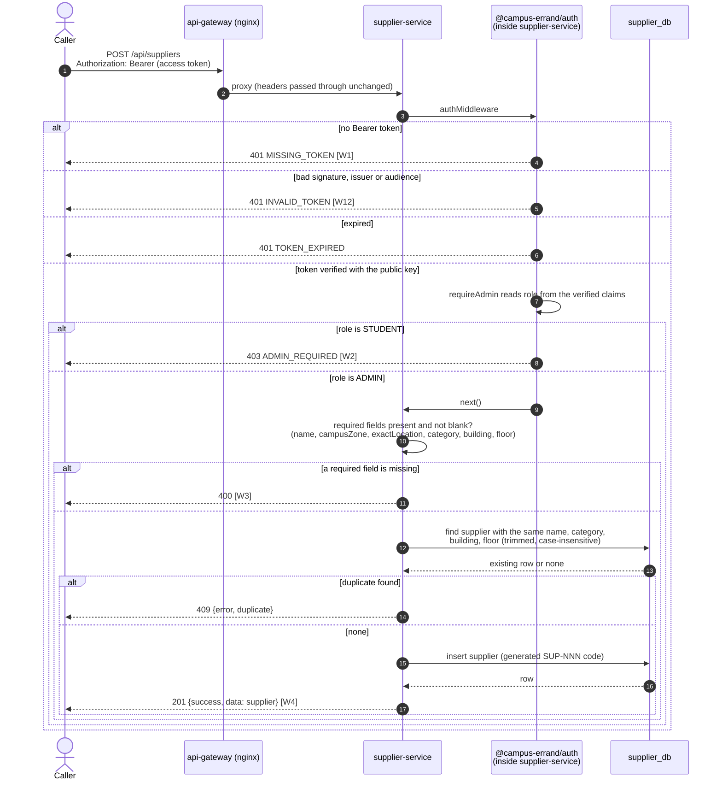

<!--
AI Assistance Disclosure:
Tool: Claude Code (model: Claude Fable 5.1), date: 2026-09-30
Scope: Added the 400 and 409 branches of the supplier write (PR #93), the role re-read on refresh, a legend and links to the PlantUML twins; re-pinned to main @ fcd5371. As built, no rationale.
Author review: <to be completed by Reallyeasy1>
-->
<!--
AI Assistance Disclosure:
Tool: Claude Code (model: Claude Fable 5.1), date: 2026-09-28
Scope: Drew the login and supplier-write sequences from auth-routes.ts, packages/auth, supplierRoutes.ts and the D2 UAT results
(check IDs in brackets). Shows what the code does; no rationale.
Author review: <to be completed by Reallyeasy1>
-->

# Login, then an allowed / denied supplier action (`main` @ fcd5371)

PlantUML versions: [`auth-login.puml`](./auth-login.puml) and [`auth-supplier-write.puml`](./auth-supplier-write.puml)
(see [Rendering](./component.md#rendering)). Check IDs refer to [`../evidence/d2/d2-checklist.md`](../evidence/d2/d2-checklist.md).

Legend: solid arrow = request or call (control flow); dashed arrow = response or data returned; `alt` / `else` = the branch the service takes.

## 1. Login and token refresh

## 2. Supplier write: 401, 403, 400, 409 or 201

user-service does not appear in the second diagram: supplier-service makes no network call to it.
`GET /api/suppliers` and `GET /api/suppliers/:id` skip both middleware steps and answer without a token [S1].
