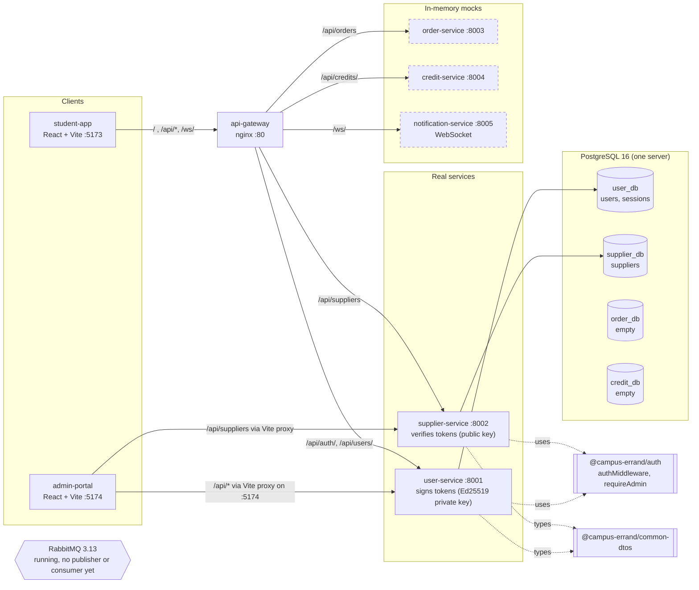

<!--
AI Assistance Disclosure:
Tool: Claude Code (model: Claude Fable 5.1), date: 2026-09-28
Scope: Drew this component diagram from docker-compose.yml, gateway/nginx.conf and the service entry points on `main` @ f0ee632.
It shows what is built, not a proposal. No rationale.
Author review: <to be completed by Reallyeasy1>
-->

# Component diagram — as built (`main` @ f0ee632)

Solid arrows are calls that happen today. Dashed boxes are in-memory mocks from the starter template.
Intended shape and sources: [`../architecture/overview.md`](../architecture/overview.md).

Notes (facts):

- supplier-service never calls user-service; it verifies the access token locally with `JWT_PUBLIC_KEY`, issuer and audience.
- The gateway only routes. It does not inspect tokens or sessions.
- `http://localhost/admin/` does not render the admin portal (see `../requirements/conflicts.md` row 19); the portal is reached on `:5174`, whose Vite dev server proxies `/api/*` to the services.
