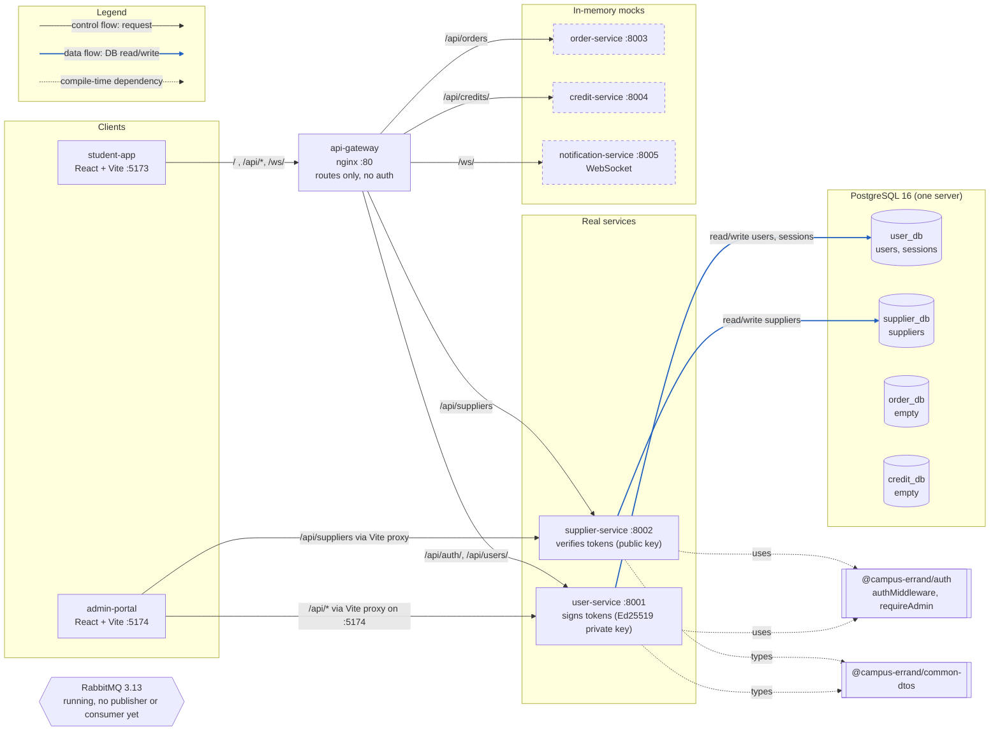

<!--
AI Assistance Disclosure:
Tool: Claude Code (model: Claude Fable 5.1), date: 2026-09-30
Scope: Added the legend, the data-flow colouring and the link to the PlantUML twin; re-pinned to main @ fcd5371 (the gateway and service facts are unchanged by PRs #92-#94 and #93). As built, no rationale.
Author review: <to be completed by Reallyeasy1>
-->
<!--
AI Assistance Disclosure:
Tool: Claude Code (model: Claude Fable 5.1), date: 2026-09-28
Scope: Drew this component diagram from docker-compose.yml, gateway/nginx.conf and the service entry points on `main` @ f0ee632.
It shows what is built, not a proposal. No rationale.
Author review: <to be completed by Reallyeasy1>
-->

# Component diagram — as built (`main` @ fcd5371)

PlantUML version: [`component.puml`](./component.puml) (see [Rendering](#rendering)).
Intended shape and sources: [`../architecture/overview.md`](../architecture/overview.md).

Legend: black solid arrow = control flow (HTTP or WebSocket request, in the direction of the call); blue solid arrow = data flow
(database read/write); dotted arrow = compile-time dependency, no runtime call; dashed box = in-memory mock from the starter
template; cylinder = database; hexagon = message broker.



Notes (facts):

- supplier-service never calls user-service; it verifies the access token locally with `JWT_PUBLIC_KEY`, issuer and audience.
- The gateway only routes. It does not inspect tokens or sessions.
- Both apps' Vite dev servers read their proxy targets from env vars (`SUPPLIER_SERVICE_URL`, `USER_SERVICE_URL`; student-app also `GATEWAY_URL`, `NOTIFICATION_SERVICE_URL`), set in `docker-compose.yml`.
- `http://localhost/admin/` does not render the admin portal (see `../requirements/conflicts.md` row 19); the portal is reached on `:5174`, whose Vite dev server proxies `/api/*` to the services.

## Rendering

Every diagram in this folder exists twice: a Mermaid block in the `.md` (GitHub renders it in place) and a `.puml` file with the same content.
To render the PlantUML files (Java required):

```bash
curl -sL -o /tmp/plantuml.jar https://github.com/plantuml/plantuml/releases/latest/download/plantuml.jar
java -jar /tmp/plantuml.jar -tsvg docs/diagrams/*.puml      # writes .svg next to each .puml; use -tpng for slides
```

Or paste a file into https://www.plantuml.com/plantuml. Rendered images are not committed; export them only for slides.
