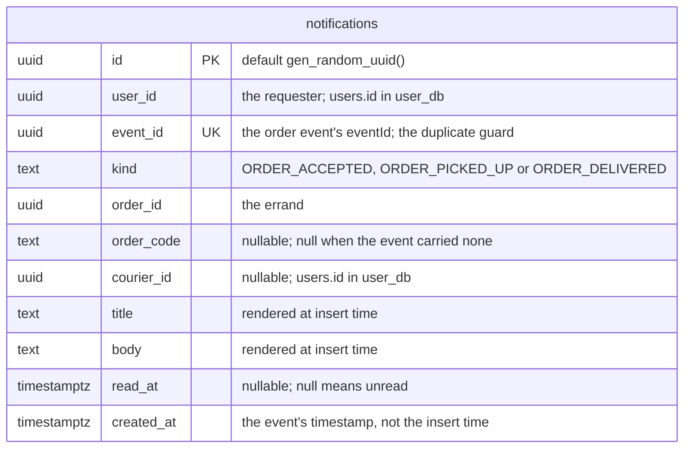

<!--
AI Assistance Disclosure:
Tool: Claude Code (model: Claude Fable 5.1), date: 2026-10-06
Scope: Transcribed services/notification-service/src/database/prisma/schema.prisma and its migration into an ER diagram, in the shape of user-schema.md. No design change.
Author review: <to be completed by Reallyeasy1>
-->

# Notification Service schema — `notification_db` (`feature/notification-service`)

PlantUML version: [`notification-schema.puml`](./notification-schema.puml) (see [Rendering](./component.md#rendering)).
Legend: `PK` / `UK` = primary, unique key. One table, no foreign keys: `user_id`, `courier_id` and `order_id` refer to rows in other services' databases.

Source: `services/notification-service/src/database/prisma/schema.prisma`, migration `20261005000000_init`.

Indexes: `notifications_event_id_key` (unique on `event_id`; a redelivered event inserts nothing) and
`notifications_user_id_created_at_idx` on (`user_id`, `created_at DESC`), which serves the "newest first for one user" list and the unread count.

Rows are never deleted or updated except to set `read_at`. The DTO the API returns (`NotificationDTO` in `packages/common-dtos`) is this row minus `user_id` and `event_id`.
