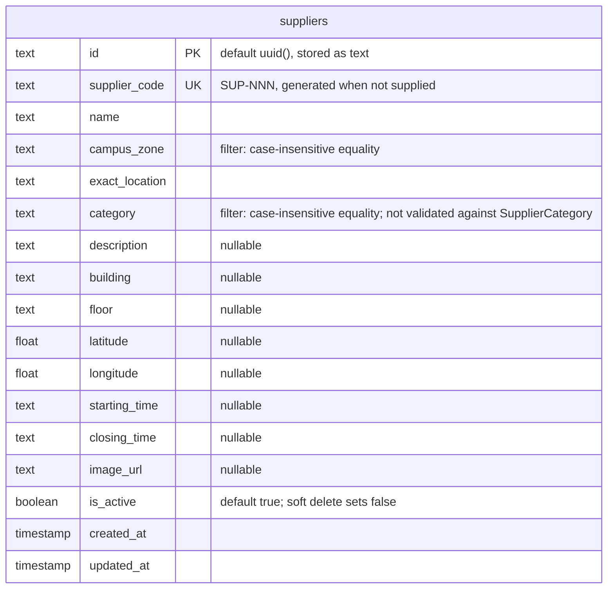

<!--
AI Assistance Disclosure:
Tool: Claude Code (model: Claude Fable 5.1), date: 2026-09-28
Scope: Transcribed services/supplier-service/src/database/prisma/schema.prisma into an ER diagram. No design change.
Author review: <to be completed by the service owner>
-->

# Supplier Service schema — `supplier_db` (`main` @ f0ee632)

Source: `services/supplier-service/src/database/prisma/schema.prisma`, migration `20260919090038_init`.
One table, no relations. Seeded with 21 rows from `data/csv/supplier-seed-data.csv`.

How the metadata is queried (`supplierRepository.ts`): `search` is a case-insensitive "contains" over `name`, `exact_location`,
`building`, `description` and `supplier_code`; `campusZone`, `category` and `isActive` are filters combined with AND; `sortBy` is one
of `name`, `campusZone`, `category`, `createdAt`, `supplierCode`. The only index besides the primary key is the unique one on `supplier_code`.
