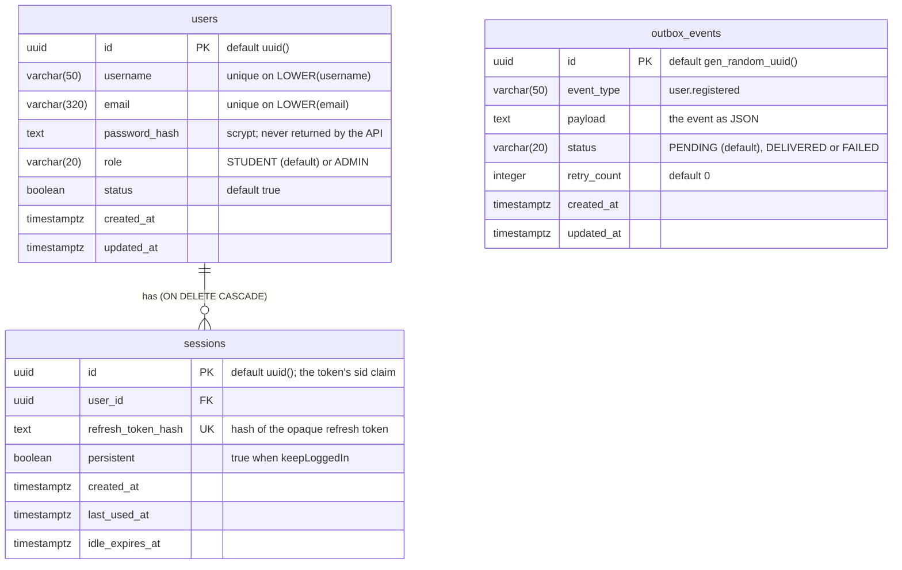

<!--
AI Assistance Disclosure:
Tool: Claude Code (model: Claude Fable 5.1), date: 2026-10-06
Scope: Added outbox_events (migration 20261003233000_add_outbox_events) as built on main @ 1109278. No design change.
Author review: <to be completed by Reallyeasy1>
-->
<!--
AI Assistance Disclosure:
Tool: Claude Code (model: Claude Fable 5.1), date: 2026-09-30
Scope: Added the link to the PlantUML twin and a legend; re-pinned to main @ fcd5371 (schema unchanged). No design change.
Author review: <to be completed by the service owner>
-->
<!--
AI Assistance Disclosure:
Tool: Claude Code (model: Claude Fable 5.1), date: 2026-09-28
Scope: Transcribed services/user-service/src/database/prisma/schema.prisma and its migrations into an ER diagram. No design change.
Author review: <to be completed by the service owner>
-->

# User Service schema — `user_db` (`main` @ 1109278)

PlantUML version: [`user-schema.puml`](./user-schema.puml) (see [Rendering](./component.md#rendering)).
Legend: crow's foot = one-to-many; `PK` / `FK` / `UK` = primary, foreign, unique key.

Source: `services/user-service/src/database/prisma/schema.prisma`, migrations
`20260922170000_initial_user_service`, `20260923150000_add_user_status` and `20261003233000_add_outbox_events`.

Indexes: `users_username_case_insensitive_uq` and `users_email_case_insensitive_uq` (expression indexes on `LOWER(...)`, created in
the migration SQL because Prisma cannot express them); `sessions_user_expiry_idx` on (`user_id`, `idle_expires_at`); `outbox_events_status_created_at_idx` on (`status`, `created_at`), which the relay uses to pick pending events in order. `outbox_events` is written in the same transaction as the user it announces and has no foreign key to `users`.

Other services refer to a user by `users.id` as a logical reference only; there are no cross-database foreign keys.
