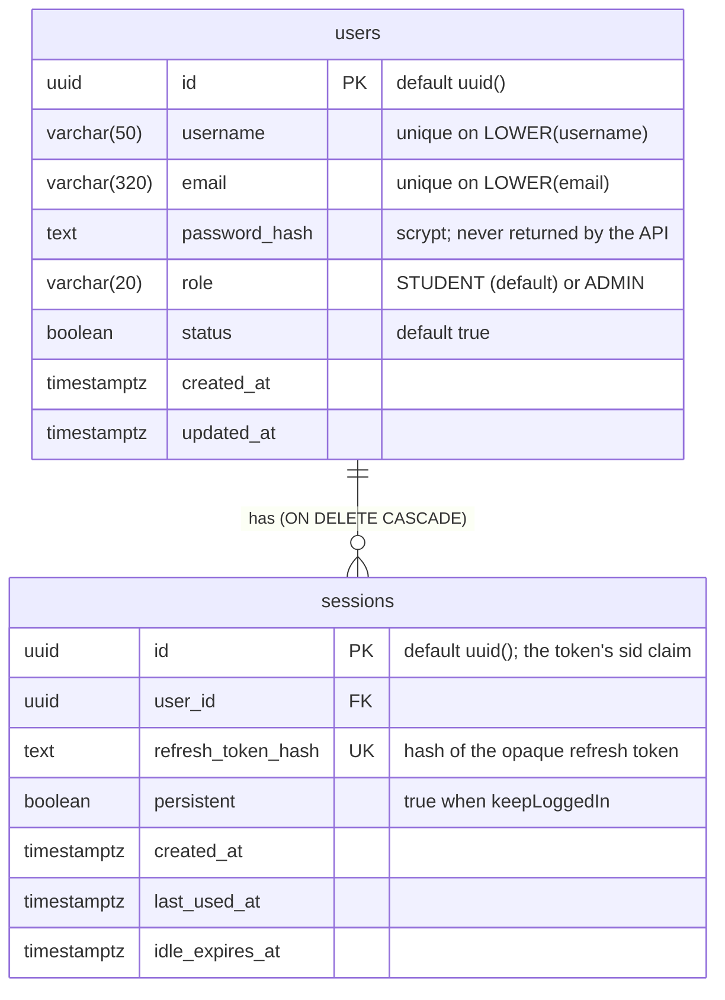

<!--
AI Assistance Disclosure:
Tool: Claude Code (model: Claude Fable 5.1), date: 2026-09-28
Scope: Transcribed services/user-service/src/database/prisma/schema.prisma and its migrations into an ER diagram. No design change.
Author review: <to be completed by the service owner>
-->

# User Service schema — `user_db` (`main` @ f0ee632)

Source: `services/user-service/src/database/prisma/schema.prisma`, migrations
`20260922170000_initial_user_service` and `20260923150000_add_user_status`.

Indexes: `users_username_case_insensitive_uq` and `users_email_case_insensitive_uq` (expression indexes on `LOWER(...)`, created in
the migration SQL because Prisma cannot express them); `sessions_user_expiry_idx` on (`user_id`, `idle_expires_at`).

Other services refer to a user by `users.id` as a logical reference only; there are no cross-database foreign keys.
