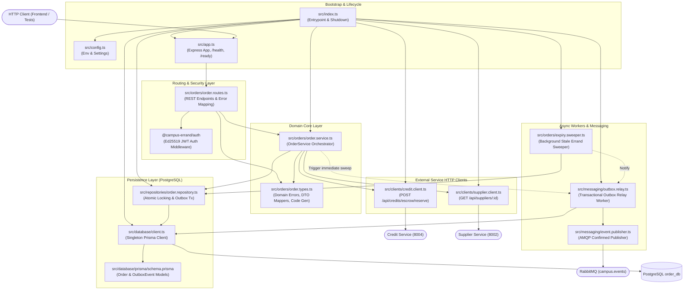
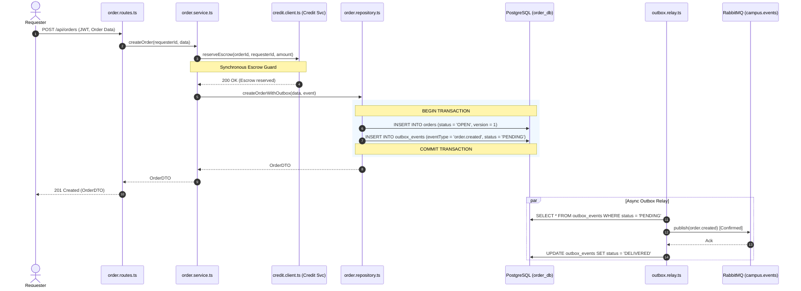
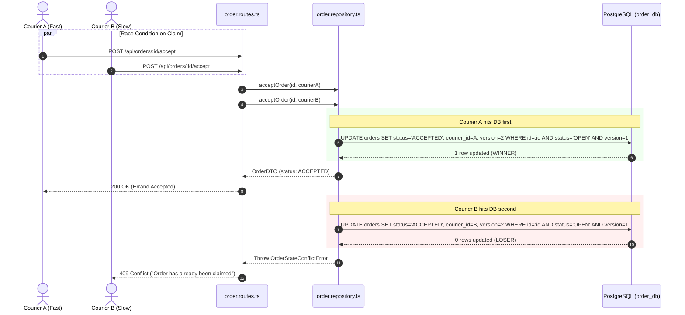
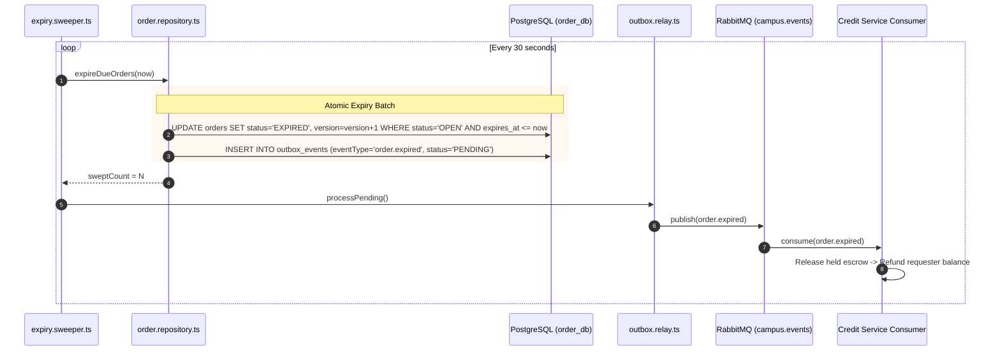

<!--
AI Assistance Disclosure:
Tool: Google Antigravity Agent, date: 2026-10-07
Scope: Comprehensive architectural map and file interaction guide for Order Service, including component hierarchy, data flows, concurrency mechanisms, and sequence diagrams.
Author review: (to be completed by author after review)
-->

# Order Service Component Architecture & Interaction Map

This document details the architectural layout, file interactions, data flows, and concurrency mechanisms of the persistent **Order Service** microservice in NUS CampusErrand / Friend of Campus (FoC).

---

## 1. High-Level Component & File Interaction Diagram

The diagram below illustrates how incoming HTTP requests flow through the transport layer, orchestrator, and external clients, down into the PostgreSQL persistence layer and out through the Transactional Outbox to RabbitMQ.

---

## 2. File Responsibilities & Interactions

### 2.1 Bootstrap & Application Factory

| File | Primary Responsibilities | Direct Collaborators |
|---|---|---|
| [`src/config.ts`](../../services/order-service/src/config.ts) | Parses and validates environment variables (`PORT`, `DATABASE_URL`, `CREDIT_SERVICE_URL`, `SUPPLIER_SERVICE_URL`, `RABBITMQ_URL`, `JWT_PUBLIC_KEY`, polling intervals). | Used by `src/index.ts`. |
| [`src/app.ts`](../../services/order-service/src/app.ts) | Factory function creating the Express application. Configures CORS, JSON body parsing, error translation, `/health` and `/ready` probes, and mounts `/api/orders`. | Uses `src/orders/order.routes.ts`. |
| [`src/index.ts`](../../services/order-service/src/index.ts) | Process entrypoint. Connects to `order_db`, instantiates clients, repository, publisher, relay, sweeper, and Express app. Handles graceful shutdown on `SIGINT`/`SIGTERM`. | Instantiates all core components. |

### 2.2 Transport & Security

| File | Primary Responsibilities | Direct Collaborators |
|---|---|---|
| [`src/orders/order.routes.ts`](../../services/order-service/src/orders/order.routes.ts) | Maps HTTP REST endpoints (`POST /api/orders`, `/accept`, `/pickup`, `/deliver`, `/complete`, `/cancel`, `/user/activity`). Maps domain errors to HTTP status codes (`400`, `401`, `403`, `404`, `409`). | Uses `@campus-errand/auth`, `src/orders/order.service.ts`, `src/orders/order.types.ts`. |

### 2.3 Domain Orchestration & Integrations

| File | Primary Responsibilities | Direct Collaborators |
|---|---|---|
| [`src/orders/order.service.ts`](../../services/order-service/src/orders/order.service.ts) | Domain orchestrator. Validates business constraints, verifies suppliers, coordinates credit escrow reservation before creation, and dispatches mutations to the repository. | Calls `src/clients/credit.client.ts`, `src/clients/supplier.client.ts`, `src/repositories/order.repository.ts`, `src/messaging/outbox.relay.ts`. |
| [`src/orders/order.types.ts`](../../services/order-service/src/orders/order.types.ts) | Defines custom error hierarchy (`OrderNotFoundError`, `OrderStateConflictError`, `OrderAuthorizationError`, `SelfAcceptForbiddenError`, `OrderValidationError`), DTO mappers, and order code generator (`ORD-XXXXX`). | Imported by `order.service.ts`, `order.routes.ts`, `order.repository.ts`. |
| [`src/clients/credit.client.ts`](../../services/order-service/src/clients/credit.client.ts) | Synchronous HTTP client communicating with Credit Service (`POST /api/credits/escrow/reserve`). Translates insufficient funds errors to domain errors. | Used by `order.service.ts`. |
| [`src/clients/supplier.client.ts`](../../services/order-service/src/clients/supplier.client.ts) | HTTP client verifying that a requested supplier exists and is active, snapshotting its name and campus zone. | Used by `order.service.ts`. |

### 2.4 Persistence & Concurrency

| File | Primary Responsibilities | Direct Collaborators |
|---|---|---|
| [`src/repositories/order.repository.ts`](../../services/order-service/src/repositories/order.repository.ts) | Encapsulates SQL transactions. Executes atomic creation of `Order` + `OutboxEvent`. Performs single-winner optimistic concurrency updates on `version`. Guards self-claims, courier identity, and requester confirmation. | Uses `src/database/client.ts`. |
| [`src/database/client.ts`](../../services/order-service/src/database/client.ts) | Singleton Prisma client instance connected to PostgreSQL `order_db`. | Wraps `src/database/generated/client`. |
| [`src/database/prisma/schema.prisma`](../../services/order-service/src/database/prisma/schema.prisma) | Schema definition for `orders` and `outbox_events` tables with composite indices (`[status, expires_at]`, `[requester_id]`, etc.). | Generates Prisma client. |
| [`src/database/seed.ts`](../../services/order-service/src/database/seed.ts) | Seeds sample open errands for local development when `orders` table is empty. | Uses `client.ts`. |

### 2.5 Background Jobs & Messaging

| File | Primary Responsibilities | Direct Collaborators |
|---|---|---|
| [`src/messaging/event.publisher.ts`](../../services/order-service/src/messaging/event.publisher.ts) | Confirmed channel RabbitMQ publisher. Publishes lifecycle events to `campus.events` exchange with `persistent: true`, `mandatory: true`, and connection recovery. | Uses `amqplib`. |
| [`src/messaging/outbox.relay.ts`](../../services/order-service/src/messaging/outbox.relay.ts) | Transactional Outbox worker. Periodically polls pending outbox rows, publishes via `event.publisher.ts`, marks rows `DELIVERED`, and isolates poisoned payloads to `FAILED`. | Uses `client.ts`, `event.publisher.ts`. |
| [`src/orders/expiry.sweeper.ts`](../../services/order-service/src/orders/expiry.sweeper.ts) | Interval-based background worker scanning for open errands past `expiresAt`. Transitions them to `EXPIRED` and inserts `order.expired` outbox events. | Uses `order.repository.ts`, `outbox.relay.ts`. |

---

## 3. Key Execution Sequences

### 3.1 Flow A: Creating an Errand with Escrow & Transactional Outbox

### 3.2 Flow B: Single-Winner Atomic Errand Claiming

### 3.3 Flow C: Automatic Errand Expiration & Refund

---

## 4. Published Events Matrix (`campus.events`)

| Event Type | Trigger | Key Payload Fields | Primary Consumers |
|---|---|---|---|
| `order.created` | New errand opened | `orderId, orderCode, requesterId, rewardCredits, campusZone, expiresAt` | `notification-service` |
| `order.accepted` | Courier claims errand | `orderId, orderCode, requesterId, courierId, acceptedAt` | `notification-service` |
| `order.in_transit` | Courier picks up item | `orderId, orderCode, requesterId, courierId, pickedUpAt` | `notification-service` |
| `order.delivered` | Courier drops off item | `orderId, orderCode, requesterId, courierId, deliveredAt` | `notification-service` |
| `order.completed` | Requester confirms delivery | `orderId, orderCode, requesterId, courierId, rewardCredits` | `credit-service` (transfers reward credits to courier), `notification-service` |
| `order.cancelled` | Requester cancels errand | `orderId, orderCode, requesterId, rewardCredits` | `credit-service` (refunds escrowed credits to requester balance), `notification-service` |
| `order.expired` | Sweeper detects expired deadline | `orderId, orderCode, requesterId, rewardCredits` | `credit-service` (refunds escrowed credits to requester balance), `notification-service` |
